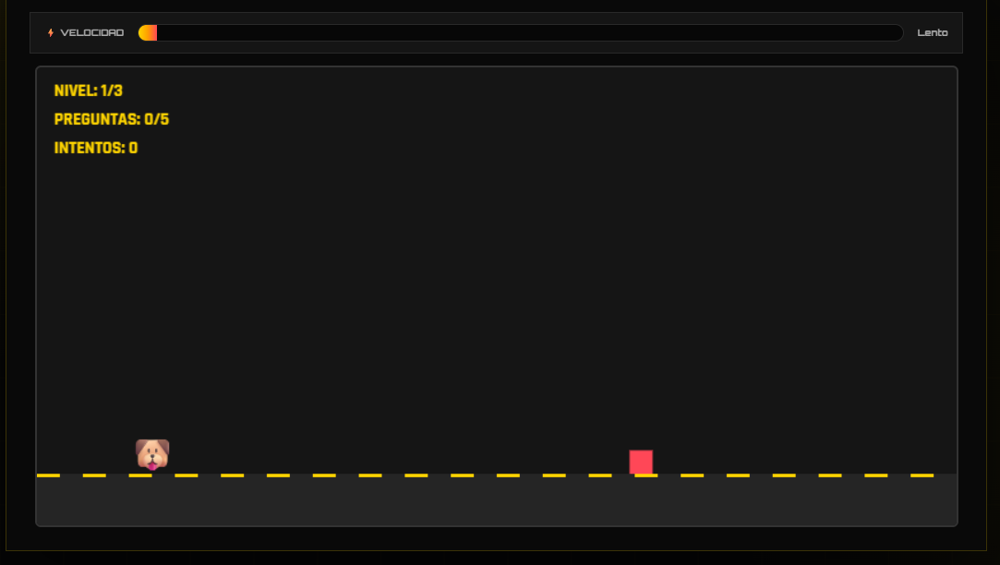
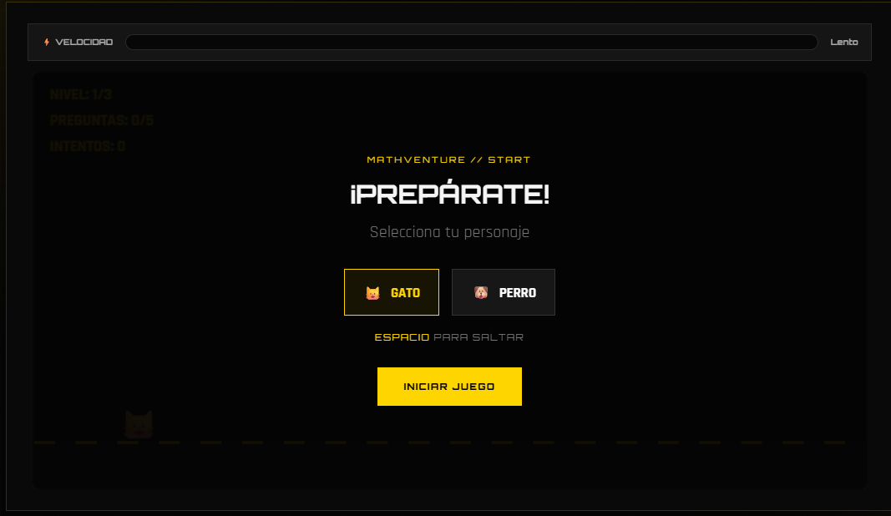
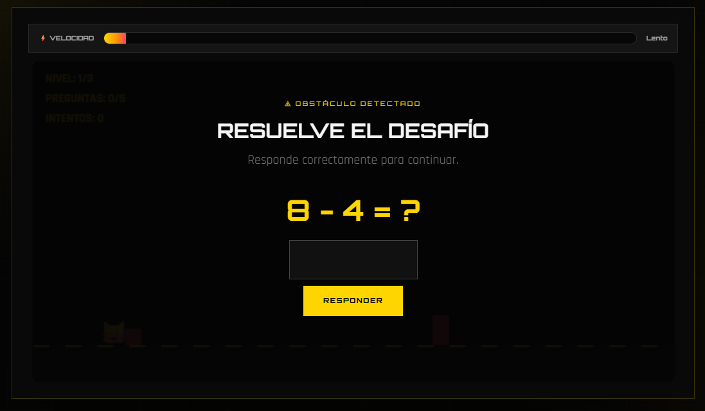

# 🎮 Mathventure (Juego 01)

¡Bienvenido al repositorio de **Mathventure**! Un videojuego de tipo *Infinite Runner 2D* desarrollado como parte de mi portafolio de Game Development.

## 🚀 Enlaces Rápidos
* 🌐 **[Jugar en Línea](https://denistae.github.io/game-development-portfolio/juego1/juego1.html)**.

---

## 📌 Descripción del Proyecto
Resuelve operaciones matemáticas a toda velocidad mientras esquivas obstáculos generados proceduralmente. El juego combina reflejos rápidos con agilidad mental en un entorno dinámico.

  
  
  

## 🛠️ Tecnologías y Características
* **HTML5 Canvas:** Utilizado para el renderizado gráfico 2D en tiempo real.
* **JavaScript (Vainilla):** Controla el bucle del juego, las físicas de salto, la generación de obstáculos y la validación de operaciones matemáticas.
* **CSS3:** Diseño responsivo con estética arcade y efectos visuales modernos.
