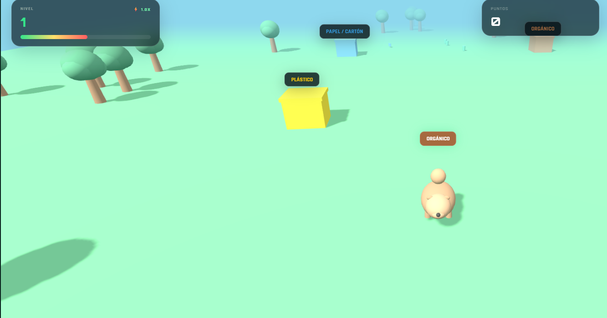
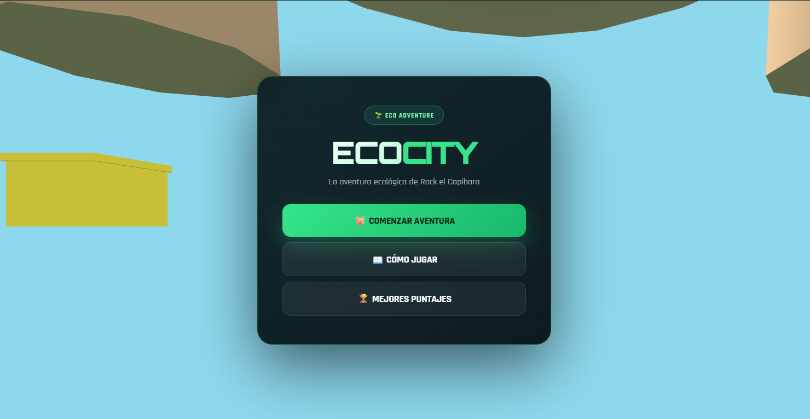
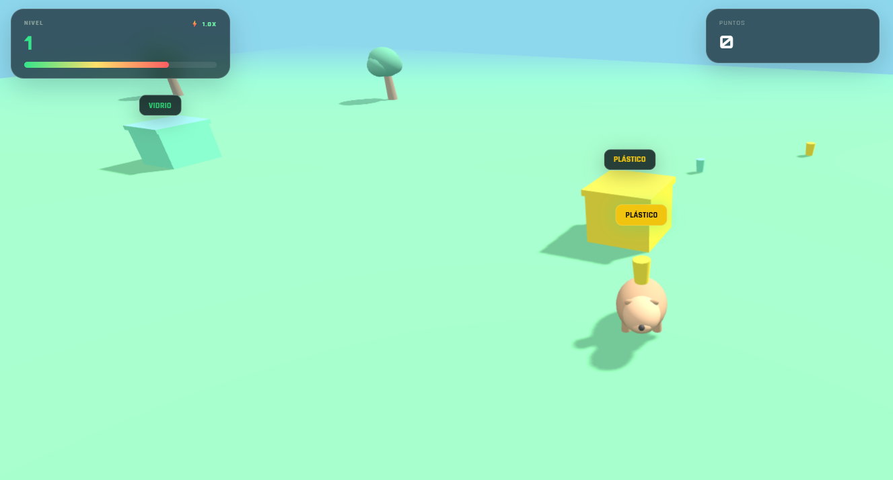

# 🌍 Ecocity (Juego 02)

¡Bienvenido al repositorio de **Ecocity**! Un videojuego de simulación 3D desarrollado como parte de mi portafolio de Game Development.

## 🚀 Jugar en Línea
Puedes jugar directamente desde el navegador haciendo clic en el siguiente enlace:

👉 **[Jugar a Ecocity en Vivo](https://denistae.github.io/game-development-portfolio/juego2/juego2.html)**

---

## 📌 Descripción del Proyecto
Explora una ciudad ecológica junto a Rock, interactuando con sistemas de energía renovable en un entorno tridimensional.
## 📸 Capturas de Pantalla

  
  
  

## 🛠️ Tecnologías y Características
* **Three.js (WebGL):** Renderizado de entornos tridimensionales interactivos en la web.
* **JavaScript:** Lógica de simulación y controles de exploración.
* **CSS3:** Estilos de interfaz y HUD del juego.
