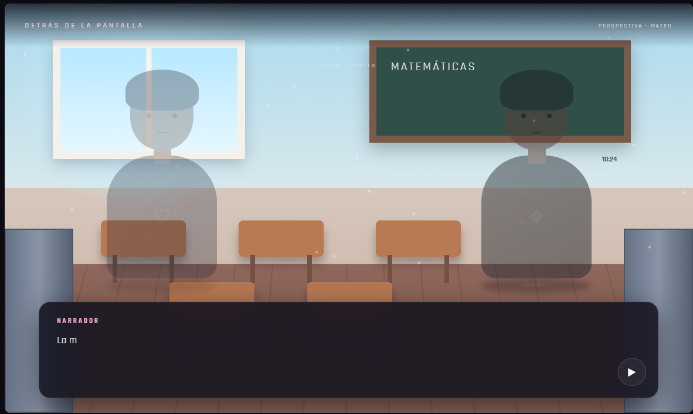
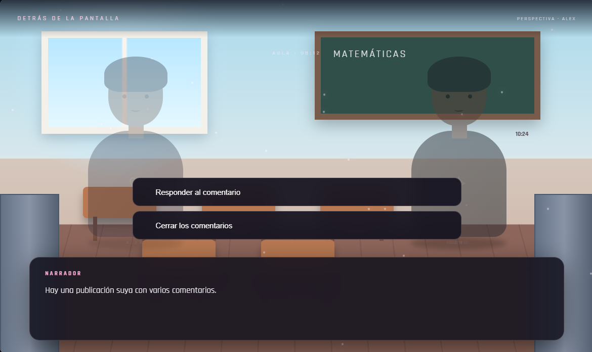
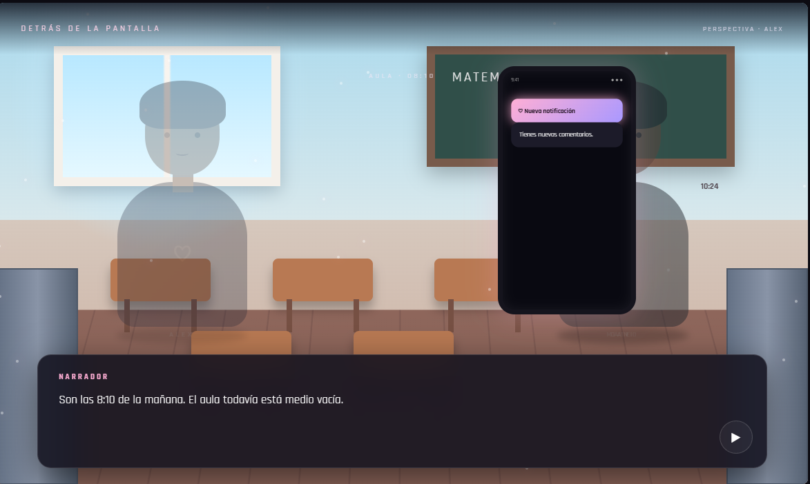

# 📱 Detrás de la Pantalla (Juego 05)

¡Bienvenido al repositorio de **Detrás de la Pantalla**! Una novela visual desarrollada como parte de mi portafolio de Game Development.

## 🚀 Jugar en Línea
Puedes jugar directamente desde el navegador haciendo clic en el siguiente enlace:

👉 **[Jugar a Detrás de la Pantalla en Vivo](https://denistae.github.io/game-development-portfolio/juego5/juego5.html)**

---

## 📌 Descripción del Proyecto
Aventura narrativa sobre el ciberbullying con un árbol de decisiones morales y mecánicas de impacto emocional.
## 📸 Capturas de Pantalla

  
  
  

## 🛠️ Tecnologías y Características
* **JavaScript Asíncrono:** Manejo de transiciones de texto, diálogos y eventos de historia.
* **CSS3 Avanzado:** Diseño de interfaces inmersivas estilo chat y novela visual.
