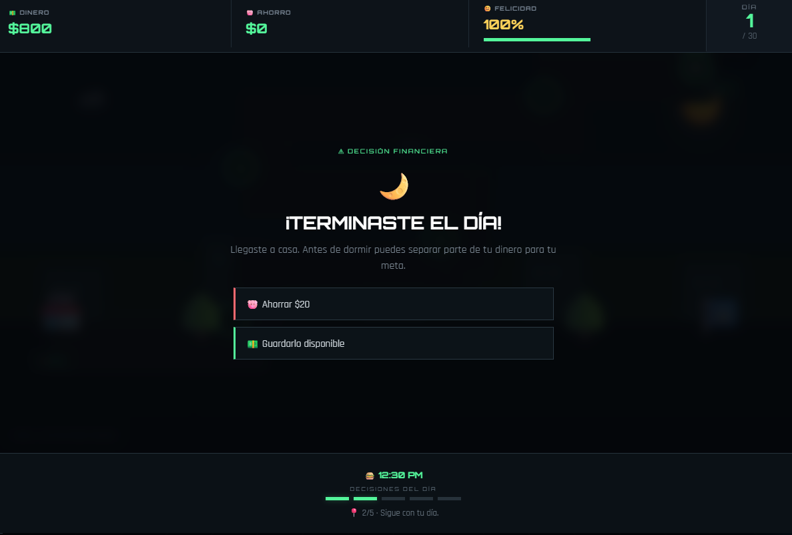
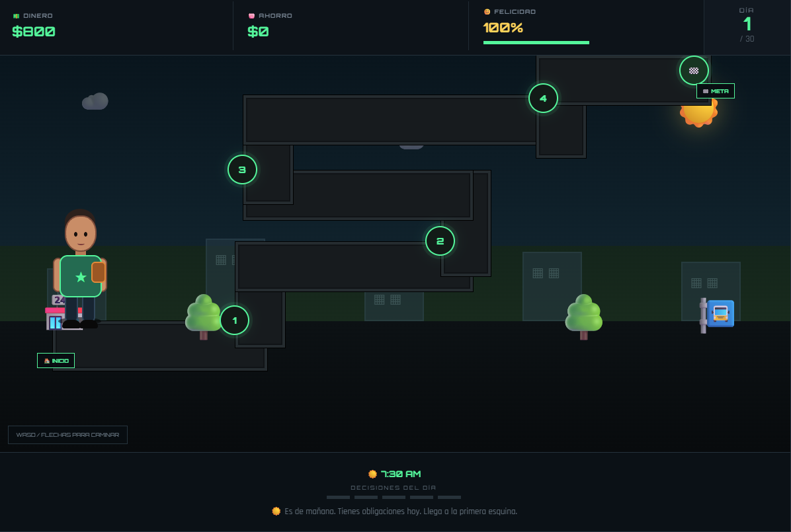

# 💵 Llega a Fin de Mes (Juego 06)

¡Bienvenido al repositorio de **Llega a Fin de Mes**! Un simulador de vida y finanzas desarrollado como parte de mi portafolio de Game Development.

## 🚀 Jugar en Línea
Puedes jugar directamente desde el navegador haciendo clic en el siguiente enlace:

👉 **[Jugar a Llega a Fin de Mes en Vivo](https://denistae.github.io/game-development-portfolio/juego5/juego5.html)**

---

## 📌 Descripción del Proyecto
Sobrevive 30 días gestionando tu sueldo, ahorros y felicidad a través de decisiones diarias en una ciudad interactiva.
## 📸 Capturas de Pantalla

  
  
  

## 🛠️ Tecnologías y Características
* **JavaScript Vainilla:** Motor de gestión de recursos, eventos aleatorios y cálculo de días.
* **CSS Moderno:** Diseño de paneles financieros y tableros interactivos intuitivos.
